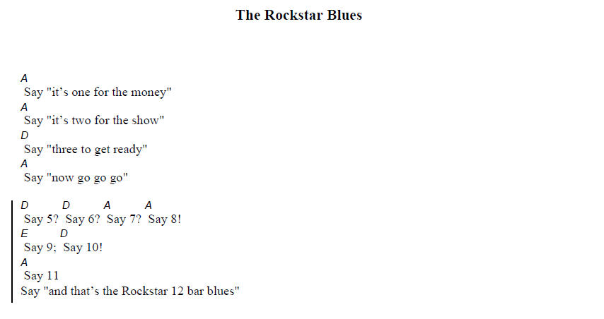

## Tutorial

If you're just getting started with Rockstar, the [Rockstar Tutorial](/tutorial) will
walk you through the basics and have you up and rocking in no time.

## "Hello, World"

"Hello World" in Rockstar looks like this:



Printing things isn't very rock‘n’roll, though. Rockers don't print, they `scream`, `shout`, `whisper` or maybe just `say` things, so these are all valid aliases for `print`:



`print`  adds a newline to the end of the output. If you don't want this, use `write`:



To read a line of input from `STDIN`, use the `listen` keyword. To read a line into a variable, use `listen to <variable>`:



Almost everything in Rockstar is case-insensitive, and most whitespace is ignored:



Rockstar statements end with a newline, or with any of the punctuation characters `.?!;`



## Command line parameters

If you're running Rockstar from the command line, you can pass parameters to your Rockstar program. Parameters beginning `-` or `--` are for the Rockstar interpreter itself:

| Argument      | Effect                                                      |
| ------------- | ----------------------------------------------------------- |
| `--version`    | Display the Rockstar version number and exit.               |

All subsequent parameters will be passed to your Rockstar program, where you can access them in a global array called `arguments`, or its aliases `the outside` or `the world`:


## Comments

The use of comments in Rockstar programs is strongly discouraged: this is rock’n’roll; it’s up to the audience to find their own meaning. If you absolutely insist on commenting your Rockstar programs, comments should be contained in parentheses `()`. Yes, this means you can’t use brackets in arithmetic expressions and may need to decompose complex expressions into multiple evaluations and assignments.


### Line comments

You can also use the `#` character to indicate a comment. Line comments last until the end of the line.

> The only reason I did this is that one of you lot might actually be unhinged enough that you want to put a `#!/bin/rockstar` at the start of their Rockstar programs so you can run them straight from your terminal... and as much as that's a *terrible* idea, I'm not going to stop you.

### ChordPro comments

Since Rockstar programs are song lyrics, it stands to reason you might want to include the chords for your programs, so aspiring rockstar developers can play along at home, so Rockstar also allows comments to be surrounded by `{ }` and `[ ]`



Running this program through the [ChordPro system](https://www.chordpro.org/) produces this:

